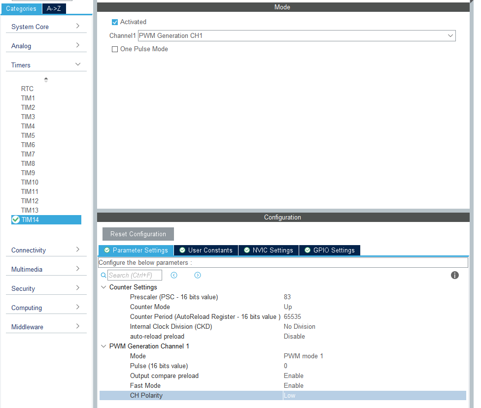

# PWM输出

在定时器的简介中说定时器具有四个通道，可以实现PWM输出的功能，本文拟用定时器PWM输出来实现一个点灯的操作。

参照上一个实例，定时器需要一些基本的配置，由于我的这个硬件PF9，10两个引脚连接了灯，而PF10恰好是TIM14唯一的一个通道，我们利用TIM14来实现。同样的查看手册发现TIM14是挂载在APB1上的，而我配置时钟树后APB1的速度为84MHz,将定时器设置83分频后，每us，CNT++，定时器一次定时最多为2^16 = 65535，也就是一次定时最多为65.535ms闪烁的时间过短，无法较好的观察到灯的闪烁效果。其实在这里有条件的同学可以使用示波器来观察波形. 那么问题就在于如何很好的呈现PWM的输出结果。下面利用两个实验来交叉验证PWM在频率和占空比方面的效果

## 前言: STM32定时器输出PWM是依据什么规则？

在上一节中我们解释了CNT和ARR的基本作用,在PWM输出中我们将要接触到另外一个寄存器,也就是CCR寄存器,在定时器中可能存在着几个CCR寄存器(CCRx:CCR1, CCR2....),这几个对应着定时器的几个通道,在CNT变化的过程中若CNT>CCR,则输出有效电平(可以通过软件控制有效电平为高电平或者低电平),反之则输出相反的电平

## 实验1 通过配置ARR肉眼观察闪烁频率变化

我们配置ARR为最大值65535，这样输出PWM的周期就是65ms左右，设置CCR为32500，由于我这块开发板上led是给定低电平亮，所以我设定有效电平是低电平。按照设想pwm会输出周期约为65ms，低电平占比约为50%pwm， 由于65ms虽然很短，但是我们肉眼依然可以可以看出他的闪烁，当我们减小ARR值并且始终保持CCR为ARR的1/2，闪烁的频率一直变高，直至人眼无法分辨。

进入CubeMX配置：



我们发现并没有设置CRR的地方,从上到下分别是配置PSC, CNT计数模式, 时钟分频, 重载初值.再下方是PWM的配置PWM模式等,我们关注图中最后一项CH Polarity,这一项配置有效电平.其余项先按图中配置,他们的含义我们可以去HAL库中找答案

完成配置生成代码后

main.c

```C
  /* Initialize all configured peripherals */
  MX_GPIO_Init();
  MX_TIM14_Init();
  /* USER CODE BEGIN 2 */
  HAL_TIM_PWM_Start(&htim14, TIM_CHANNEL_1);//启动pwm输出
  htim14.Instance->CCR1 = 30000;//设置CCR
  /* USER CODE END 2 */

  /* Infinite loop */
  /* USER CODE BEGIN WHILE */
  while (1)
  {
    /* USER CODE END WHILE */

    /* USER CODE BEGIN 3 */
  }
```

下载运行后便可以看到效果,符合预期

## 实验2 设置高频观察亮度占空比变化

pwm输出到led,当给定固定电压时候,led最亮,通过调节占空比就能调节led的亮度,同上个实验一样.在此就不多赘述,通过ARR让灯保持一个较高的频率闪烁,随后在主函数里调节CRR1,观察到灯的亮度变化.

## 拓展延伸

在我们配置好之后,观察生成用于初始化的代码,与上一个实例来做一下比较

```C
void MX_TIM14_Init(void)
{

  /* USER CODE BEGIN TIM14_Init 0 */

  /* USER CODE END TIM14_Init 0 */

  TIM_OC_InitTypeDef sConfigOC = {0};

  /* USER CODE BEGIN TIM14_Init 1 */

  /* USER CODE END TIM14_Init 1 */
  htim14.Instance = TIM14;
  htim14.Init.Prescaler = 83;
  htim14.Init.CounterMode = TIM_COUNTERMODE_UP;
  htim14.Init.Period = 500;
  htim14.Init.ClockDivision = TIM_CLOCKDIVISION_DIV1;
  htim14.Init.AutoReloadPreload = TIM_AUTORELOAD_PRELOAD_DISABLE;
  if (HAL_TIM_Base_Init(&htim14) != HAL_OK)
  {
    Error_Handler();
  }
  if (HAL_TIM_PWM_Init(&htim14) != HAL_OK)
  {
    Error_Handler();
  }
  sConfigOC.OCMode = TIM_OCMODE_PWM1;
  sConfigOC.Pulse = 0;
  sConfigOC.OCPolarity = TIM_OCPOLARITY_HIGH;
  sConfigOC.OCFastMode = TIM_OCFAST_ENABLE;
  if (HAL_TIM_PWM_ConfigChannel(&htim14, &sConfigOC, TIM_CHANNEL_1) != HAL_OK)
  {
    Error_Handler();
  }
  /* USER CODE BEGIN TIM14_Init 2 */

  /* USER CODE END TIM14_Init 2 */
  HAL_TIM_MspPostInit(&htim14);

}

```

可以看到在完成定时器配置后,执行了`HAL_TIM_PWM_ConfigChannel(&htim14, &sConfigOC, TIM_CHANNEL_1)`来配置他的一个通道, 他的配置是:
```C
sConfigOC.OCMode = TIM_OCMODE_PWM1;
sConfigOC.Pulse = 0;
sConfigOC.OCPolarity = TIM_OCPOLARITY_HIGH;
sConfigOC.OCFastMode = TIM_OCFAST_ENABLE;
```

这个配置对应着CubeMX中的PWM配置

敏锐的我们可以发现一点是这是OC Config 也就是这是一个output compare的配置,而pwm输出实际上是输出比较的一种.

### 那么什么是输出比较呢? 我们回顾上文中提到的生成pwm的原理.

比较输出[Compare Output]功能：定时器通过对预设的比较值与定时器的值做匹配比较之后，并依据相应的输出模式从而实现各类输出。如PWM输出、电平翻转、单脉冲模式、强制输出等。一般来说，STM32的通用定时器和高级定时器都具有比较输出功能，不同的定时器可能通道数量上有差异。

### 在选择pwm模式时候有两个pwm模式可选,我们选择一个模式,那么这个模式影响着什么?

答案很简单,当我们选择pwm模式1的时候: `CNT<CCR` 时就输出无效电平,反之;相反的我们选择模式2后`CNT<CCR`是输出有效电平

我们查看`TIM_OCMODE_PWM1`的定义,在他的上下文定义了OC的几个模式

```C
#define TIM_OCMODE_TIMING                   0x00000000U                                              /*!< Frozen                                 */
#define TIM_OCMODE_ACTIVE                   TIM_CCMR1_OC1M_0                                         /*!< Set channel to active level on match   */
#define TIM_OCMODE_INACTIVE                 TIM_CCMR1_OC1M_1                                         /*!< Set channel to inactive level on match */
#define TIM_OCMODE_TOGGLE                   (TIM_CCMR1_OC1M_1 | TIM_CCMR1_OC1M_0)                    /*!< Toggle                                 */
#define TIM_OCMODE_PWM1                     (TIM_CCMR1_OC1M_2 | TIM_CCMR1_OC1M_1)                    /*!< PWM mode 1                             */
#define TIM_OCMODE_PWM2                     (TIM_CCMR1_OC1M_2 | TIM_CCMR1_OC1M_1 | TIM_CCMR1_OC1M_0) /*!< PWM mode 2                             */
#define TIM_OCMODE_FORCED_ACTIVE            (TIM_CCMR1_OC1M_2 | TIM_CCMR1_OC1M_0)                    /*!< Force active level                     */
#define TIM_OCMODE_FORCED_INACTIVE          TIM_CCMR1_OC1M_2                                         /*!< Force inactive level                   */
```

### 在设置CCR调节占空比的时候,我们直接了当的通过htim14指针来修改,不够优雅?

既然我们使用了HAL库, HAL库推行出来就是为了避免直接操作寄存器, 简化学习;我们虽然利用了HAL库,但是这样子本质上依旧是通过一个指针去直接修改CCR寄存器的值,完全不够优雅.

其实HAL库提供了修改的接口,我们可以直接利用他来修改.

首先在代码生成阶段CubeMX中的配置中有pause选项,这一项其实就是设置CCR的值.在上面的配置中
我们都没有管这一项,让其默认为0,然后再主函数里面修改CCR的值.

这个时候疑问就来了,如果不使用指针去直接修改CCR的值,而在最初配置好,那么在运行的过程中不就没有办法修改了吗(ARR同理)

其实在HAL库中提供了修改的函数,由于定时器的函数过多,选择几个来说:

- 首先是在上一个实例中我们讲到过HAL库中有宏来实现
- 参照`HAL_TIM_PWM_ConfigChannel(&htim14, &sConfigOC, TIM_CHANNEL_1)`


