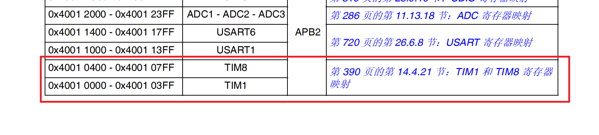
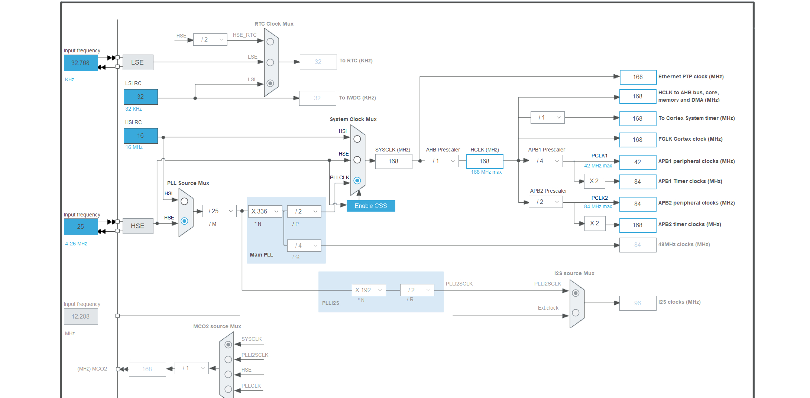
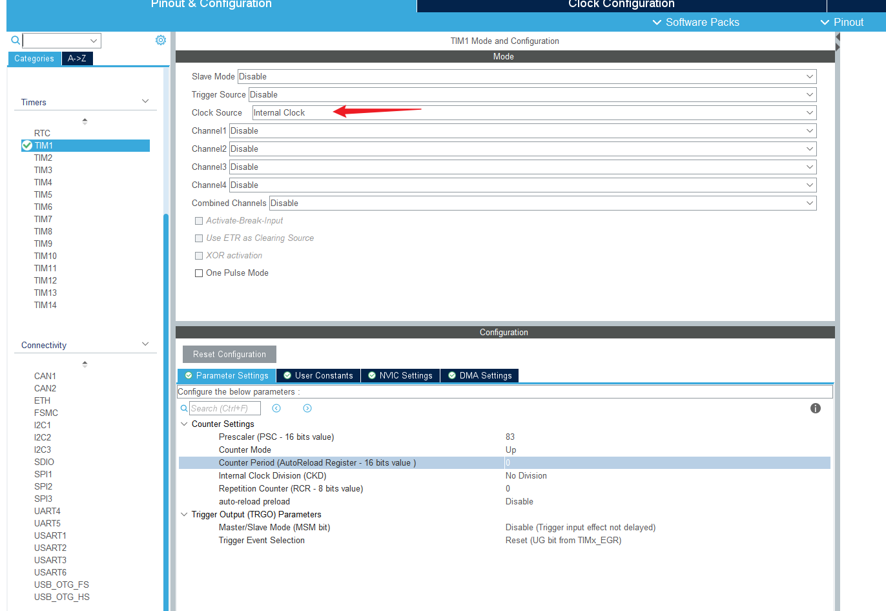
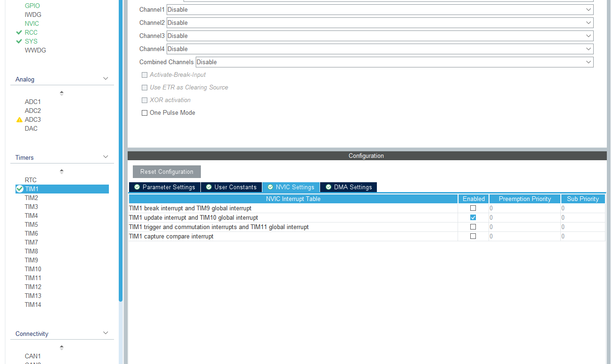

# 基本定时器功能

在定时器内部会有一个值,每当一个周期这个值都会-1/+1,通过查看这个值就可以知道时间
在这里我想用TIM1来完成一个基本的定时器功能,首先芯片参考手册,可以看到TIM1被挂载到APB2总线上.


在CubeMX中初始化时钟树.可以得知APB2时钟速率为168MHz (一个脉冲时间为 1/168 us)



在CubeMX中初始化



可以看生成用于初始化的代码

```C
void MX_TIM1_Init(void)
{

  /* USER CODE BEGIN TIM1_Init 0 */

  /* USER CODE END TIM1_Init 0 */

  TIM_ClockConfigTypeDef sClockSourceConfig = {0};
  TIM_MasterConfigTypeDef sMasterConfig = {0};

  /* USER CODE BEGIN TIM1_Init 1 */

  /* USER CODE END TIM1_Init 1 */
  htim1.Instance = TIM1; //设置定时器
  htim1.Init.Prescaler = 167; //分频系数, 分频后时钟为1MHZ
  htim1.Init.CounterMode = TIM_COUNTERMODE_UP; // 计数模式, 向上计数
  htim1.Init.Period = 0; //自动装载器的值
  htim1.Init.ClockDivision = TIM_CLOCKDIVISION_DIV1; //时钟分频
  htim1.Init.RepetitionCounter = 0;  //重复计数器值 这个设置经存在与高级计数器
  htim1.Init.AutoReloadPreload = TIM_AUTORELOAD_PRELOAD_DISABLE; // 自动装载初始值关闭
  if (HAL_TIM_Base_Init(&htim1) != HAL_OK)
  {
    Error_Handler();
  }
  sClockSourceConfig.ClockSource = TIM_CLOCKSOURCE_INTERNAL;
  if (HAL_TIM_ConfigClockSource(&htim1, &sClockSourceConfig) != HAL_OK)
  {
    Error_Handler();
  }
  sMasterConfig.MasterOutputTrigger = TIM_TRGO_RESET;
  sMasterConfig.MasterSlaveMode = TIM_MASTERSLAVEMODE_DISABLE;
  if (HAL_TIMEx_MasterConfigSynchronization(&htim1, &sMasterConfig) != HAL_OK)
  {
    Error_Handler();
  }
  /* USER CODE BEGIN TIM1_Init 2 */

  /* USER CODE END TIM1_Init 2 */

}
```

在主函数中我们使用HAL_Delay来延时以实现一个灯的闪烁效果,延时时间为500ms

```C
HAL_Delay(500);
HAL_GPIO_TogglePin(GPIOF, GPIO_PIN_9);
```

然后我们使用定时器来实现一个同样的效果,也就是使用定时器来实现一个延时的效果,对于1MHz的时钟,一个周期为1us,500ms = 500*1000 us = 500000 > 2^16 也就是需要多次定时,在这里我们实现一个ms级别的延时,将其延时500次即可,通过轮询的方式来一直查询定时器里面的值

```C
void Tim_Delay_Ms(int ms){
  while(ms){
    uint16_t counter = 0; //同于定时器中counter的值
    __HAL_TIM_SET_AUTORELOAD(&htim1, 1000); //设置自动装填值
    __HAL_TIM_SET_COUNTER(&htim1, counter); //设置counter值
    HAL_TIM_Base_Start(&htim1); //启动定时器
    while(counter!=1000){ //比较counter值
      counter = __HAL_TIM_GET_COUNTER(&htim1); //读取counter值
    }
    HAL_TIM_Base_Stop(&htim1); //停止定时器
    ms--;
  }
}
```

main.c里面改为

```C
Tim_Delay_Ms(500);
HAL_GPIO_TogglePin(GPIOF, GPIO_PIN_9);
```

经过上述实验,两者达到同样的效果, 值得注意的是在函数的代码中所使用到的,以`__`开头的并不是函数而是宏.
接下来我们尝试使用定时器中断的方式来实现这个灯闪烁的效果,为了方便对比,这次使用两个Led,引脚对应PF9,PF10.一个使用HAL_Delay另外一个使用定时器中断
整体的思路为,将定时器counter初始值设置为1000 当1ms/1000us后counter等于预加载值,单片机上产生一个中断信号,单片机将会每1ms产生一个溢出中断,通过合理的处理中断来实现延时.
首先在CubeMX中配置,在NVIC Setting中勾选上TIM1的更新中断。



在`stm32f4xx_it.c`中生成了相关代码,在这个函数里面来处理中断.当计数器向上溢出/向下溢出，计数器初始化(通过软件或者内部/外部触发)就会触发这个中断

```C
/**
  * @brief This function handles TIM1 break interrupt and TIM9 global interrupt.
  */
void TIM1_UP_TIM10_IRQHandler(void)
{
  /* USER CODE BEGIN TIM1_BRK_TIM9_IRQn 0 */

  /* USER CODE END TIM1_BRK_TIM9_IRQn 0 */
  HAL_TIM_IRQHandler(&htim1);
  /* USER CODE BEGIN TIM1_BRK_TIM9_IRQn 1 */

  /* USER CODE END TIM1_BRK_TIM9_IRQn 1 */
}
```

我们需要一个变量来存储,来看这个定时器中断多少次.
main.c

```C
int itTimes = 0;
int itMax = 500 //中断500次, 也就是500ms
```

```C
  /* USER CODE BEGIN 2 */
  HAL_GPIO_WritePin(GPIOF, GPIO_PIN_9, GPIO_PIN_RESET); //让两个led到同一个状态
  HAL_GPIO_WritePin(GPIOF, GPIO_PIN_10, GPIO_PIN_RESET);
  HAL_TIM_Base_Start_IT(&htim1);//启动定时器并开启中断
  /* USER CODE END 2 */

  /* Infinite loop */
  /* USER CODE BEGIN WHILE */
  while (1)
  {
    HAL_Delay(500); //程序主循环,pf9的闪烁
    //Tim_Delay_Ms(500);
    HAL_GPIO_TogglePin(GPIOF, GPIO_PIN_9);
    /* USER CODE END WHILE */

    /* USER CODE BEGIN 3 */
  }
```


在定时器相关的代码文件中改写中断函数, 当这个中断到itMax次后,反转PF10的电平

stm32f4xx_it.c

```C
extern int itTimes;
extern int itMax;

void TIM1_UP_TIM10_IRQHandler(void)
{
  /* USER CODE BEGIN TIM1_UP_TIM10_IRQn 0 */
  itTimes++;
  if(itTimes == itMax){
    itTimes = 0;
    HAL_GPIO_TogglePin(GPIOF, GPIO_PIN_10);
  
  }
  /* USER CODE END TIM1_UP_TIM10_IRQn 0 */
  HAL_TIM_IRQHandler(&htim1);
  /* USER CODE BEGIN TIM1_UP_TIM10_IRQn 1 */

  /* USER CODE END TIM1_UP_TIM10_IRQn 1 */
}

```

运行后便可以看到PF9,10同时亮灭.时间为500ms

# 拓展延伸

从原理上来看，STM32的定时器里面到底包含一些什么呢？我们可以从HAL库的源码中一探究竟；当我们在CubeMX中配置好一个定时器后，生成的代码中便有了一个handle--`htimx`,其中x是定时器编号例如TIM1所生成的就是htim1，他的类型是`TIM_HandleTypeDef`,这是一个结构体，他的具体定义如下：

```C
typedef struct
#endif /* USE_HAL_TIM_REGISTER_CALLBACKS */
{
  TIM_TypeDef                        *Instance;         /*!< Register base address                             */
  TIM_Base_InitTypeDef               Init;              /*!< TIM Time Base required parameters                 */
  HAL_TIM_ActiveChannel              Channel;           /*!< Active channel                                    */
  DMA_HandleTypeDef                  *hdma[7];          /*!< DMA Handlers array
                                                             This array is accessed by a @ref DMA_Handle_index */
  HAL_LockTypeDef                    Lock;              /*!< Locking object                                    */
  __IO HAL_TIM_StateTypeDef          State;             /*!< TIM operation state                               */
  __IO HAL_TIM_ChannelStateTypeDef   ChannelState[4];   /*!< TIM channel operation state                       */
  __IO HAL_TIM_ChannelStateTypeDef   ChannelNState[4];  /*!< TIM complementary channel operation state         */
  __IO HAL_TIM_DMABurstStateTypeDef  DMABurstState;     /*!< DMA burst operation state                         */

#if (USE_HAL_TIM_REGISTER_CALLBACKS == 1)
  void (* Base_MspInitCallback)(struct __TIM_HandleTypeDef *htim);              /*!< TIM Base Msp Init Callback                              */
  void (* Base_MspDeInitCallback)(struct __TIM_HandleTypeDef *htim);            /*!< TIM Base Msp DeInit Callback                            */
  void (* IC_MspInitCallback)(struct __TIM_HandleTypeDef *htim);                /*!< TIM IC Msp Init Callback                                */
  void (* IC_MspDeInitCallback)(struct __TIM_HandleTypeDef *htim);              /*!< TIM IC Msp DeInit Callback                              */
  void (* OC_MspInitCallback)(struct __TIM_HandleTypeDef *htim);                /*!< TIM OC Msp Init Callback                                */
  void (* OC_MspDeInitCallback)(struct __TIM_HandleTypeDef *htim);              /*!< TIM OC Msp DeInit Callback                              */
  void (* PWM_MspInitCallback)(struct __TIM_HandleTypeDef *htim);               /*!< TIM PWM Msp Init Callback                               */
  void (* PWM_MspDeInitCallback)(struct __TIM_HandleTypeDef *htim);             /*!< TIM PWM Msp DeInit Callback                             */
  void (* OnePulse_MspInitCallback)(struct __TIM_HandleTypeDef *htim);          /*!< TIM One Pulse Msp Init Callback                         */
  void (* OnePulse_MspDeInitCallback)(struct __TIM_HandleTypeDef *htim);        /*!< TIM One Pulse Msp DeInit Callback                       */
  void (* Encoder_MspInitCallback)(struct __TIM_HandleTypeDef *htim);           /*!< TIM Encoder Msp Init Callback                           */
  void (* Encoder_MspDeInitCallback)(struct __TIM_HandleTypeDef *htim);         /*!< TIM Encoder Msp DeInit Callback                         */
  void (* HallSensor_MspInitCallback)(struct __TIM_HandleTypeDef *htim);        /*!< TIM Hall Sensor Msp Init Callback                       */
  void (* HallSensor_MspDeInitCallback)(struct __TIM_HandleTypeDef *htim);      /*!< TIM Hall Sensor Msp DeInit Callback                     */
  void (* PeriodElapsedCallback)(struct __TIM_HandleTypeDef *htim);             /*!< TIM Period Elapsed Callback                             */
  void (* PeriodElapsedHalfCpltCallback)(struct __TIM_HandleTypeDef *htim);     /*!< TIM Period Elapsed half complete Callback               */
  void (* TriggerCallback)(struct __TIM_HandleTypeDef *htim);                   /*!< TIM Trigger Callback                                    */
  void (* TriggerHalfCpltCallback)(struct __TIM_HandleTypeDef *htim);           /*!< TIM Trigger half complete Callback                      */
  void (* IC_CaptureCallback)(struct __TIM_HandleTypeDef *htim);                /*!< TIM Input Capture Callback                              */
  void (* IC_CaptureHalfCpltCallback)(struct __TIM_HandleTypeDef *htim);        /*!< TIM Input Capture half complete Callback                */
  void (* OC_DelayElapsedCallback)(struct __TIM_HandleTypeDef *htim);           /*!< TIM Output Compare Delay Elapsed Callback               */
  void (* PWM_PulseFinishedCallback)(struct __TIM_HandleTypeDef *htim);         /*!< TIM PWM Pulse Finished Callback                         */
  void (* PWM_PulseFinishedHalfCpltCallback)(struct __TIM_HandleTypeDef *htim); /*!< TIM PWM Pulse Finished half complete Callback           */
  void (* ErrorCallback)(struct __TIM_HandleTypeDef *htim);                     /*!< TIM Error Callback                                      */
  void (* CommutationCallback)(struct __TIM_HandleTypeDef *htim);               /*!< TIM Commutation Callback                                */
  void (* CommutationHalfCpltCallback)(struct __TIM_HandleTypeDef *htim);       /*!< TIM Commutation half complete Callback                  */
  void (* BreakCallback)(struct __TIM_HandleTypeDef *htim);                     /*!< TIM Break Callback                                      */
#endif /* USE_HAL_TIM_REGISTER_CALLBACKS */
} TIM_HandleTypeDef;
```
可以在这个结构体body的第一行发现一个指针`*Instance`, 在后面有注释 register base address 也就是这个指针指向的地址存放了一些寄存器的地址, 我们继续往下看这个指针的类型为`TIM_TypeDef` 那么这个里面究竟放了那些寄存器呢,打开这个结构体的定义:
```C
typedef struct
{
  __IO uint32_t CR1;         /*!< TIM control register 1,              Address offset: 0x00 */
  __IO uint32_t CR2;         /*!< TIM control register 2,              Address offset: 0x04 */
  __IO uint32_t SMCR;        /*!< TIM slave mode control register,     Address offset: 0x08 */
  __IO uint32_t DIER;        /*!< TIM DMA/interrupt enable register,   Address offset: 0x0C */
  __IO uint32_t SR;          /*!< TIM status register,                 Address offset: 0x10 */
  __IO uint32_t EGR;         /*!< TIM event generation register,       Address offset: 0x14 */
  __IO uint32_t CCMR1;       /*!< TIM capture/compare mode register 1, Address offset: 0x18 */
  __IO uint32_t CCMR2;       /*!< TIM capture/compare mode register 2, Address offset: 0x1C */
  __IO uint32_t CCER;        /*!< TIM capture/compare enable register, Address offset: 0x20 */
  __IO uint32_t CNT;         /*!< TIM counter register,                Address offset: 0x24 */
  __IO uint32_t PSC;         /*!< TIM prescaler,                       Address offset: 0x28 */
  __IO uint32_t ARR;         /*!< TIM auto-reload register,            Address offset: 0x2C */
  __IO uint32_t RCR;         /*!< TIM repetition counter register,     Address offset: 0x30 */
  __IO uint32_t CCR1;        /*!< TIM capture/compare register 1,      Address offset: 0x34 */
  __IO uint32_t CCR2;        /*!< TIM capture/compare register 2,      Address offset: 0x38 */
  __IO uint32_t CCR3;        /*!< TIM capture/compare register 3,      Address offset: 0x3C */
  __IO uint32_t CCR4;        /*!< TIM capture/compare register 4,      Address offset: 0x40 */
  __IO uint32_t BDTR;        /*!< TIM break and dead-time register,    Address offset: 0x44 */
  __IO uint32_t DCR;         /*!< TIM DMA control register,            Address offset: 0x48 */
  __IO uint32_t DMAR;        /*!< TIM DMA address for full transfer,   Address offset: 0x4C */
  __IO uint32_t OR;          /*!< TIM option register,                 Address offset: 0x50 */
} TIM_TypeDef;
```
这里的寄存器过多过于复杂,通过查阅数据手册便可以知道这些寄存器的作用.在这里我简单介绍我们在上面的实例中用到的(其实后面的注释已经写的很清楚)

- CNT 计数寄存器,一个时钟周期变化一次+1/-1(可以通过CR寄存器控制)
- ARR 重载值,如何很好的理解ARR,在上文中我们设置了ARR的值,设置CNT向上计数,开始时CNT装载为0,CNT不断++,直至CNT==ARR这个时候触发定时器的update interrupt,处理完后CNT置0重复这个过程. 当设置向下计数时候CNT会被装载ARR的值,不断--,直至到0,触发update interrupt.

